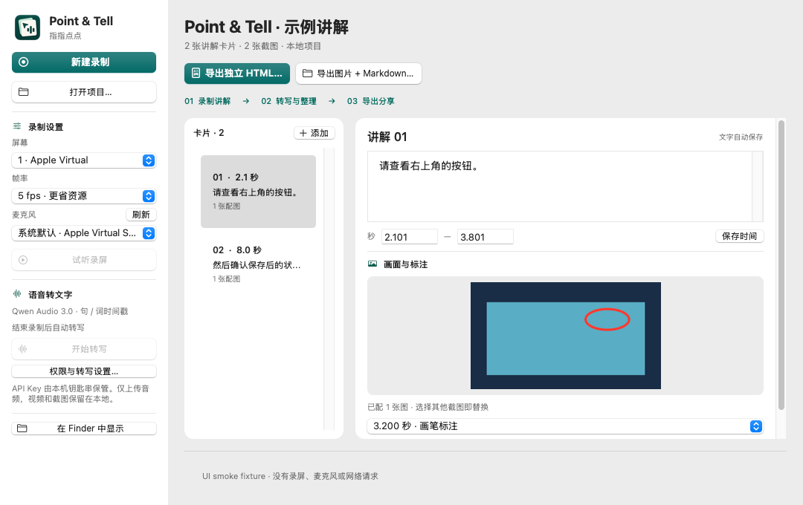

# Point & Tell · 指指点点


Record your screen while explaining what should change. Mark the important moments, draw on a frozen screenshot, then turn your explanation into editable text-and-image cards and an offline HTML file.

**New in v0.2.1:** timestamp-aligned speech and screenshots in HTML/Markdown, retained word-level ASR timing, and two always-visible export actions. See [export alignment](docs/EXPORT-ALIGNMENT.md).



**Native macOS 11+, Intel + Apple Silicon. Preview v0.2.0.** No Electron, local language model, account, server, or database.

## Get the app

[Download v0.2.0 Universal](releases/v0.2.0/Point-and-Tell-v0.2.0-macOS-universal.zip?raw=true) for Intel and Apple Silicon. The application ZIP, SHA-256 checksum and exact source/build manifest are committed under [releases/v0.2.0](releases/v0.2.0). See the [release notes](releases/README.md) for verification and rollback details.

The app is ad-hoc signed, **not Apple-notarized**. On macOS 11, extract the ZIP, move the app to Applications, then use Finder → right-click → Open if Gatekeeper asks. Do not disable system security. No Apple Developer account is required to build locally.

## Use

1. Select one screen, 5 fps (default) or 10 fps, and a microphone. **系统默认** is resolved again when recording starts; choose a named built-in/external mic if the default is wrong. **刷新** updates the list. Click **新建录制** and choose a new local `.pointtell` project folder
2. Grant Screen Recording and Microphone permission in System Preferences → Security & Privacy → Privacy; quit and reopen if macOS requests it
3. Speak normally and check the live microphone name/level in the floating toolbar. A flat or very low meter means you should check the selected input and macOS Sound → Input volume before continuing. **标记** (Control–Option–M) saves a screenshot with the pointer highlighted. **画笔** freezes the current screenshot for drawing while voice continues; undo/clear, then save and continue
4. Stop and wait for the local audio-track/decode check. Use **试听录屏** to confirm your speech is audible. Original MOV, PNG screenshots and the project manifest remain local
5. Optionally enter an Alibaba Cloud API key and choose **开始转写** (or **继续 / 重试转写**). The app asks before uploading audio; only microphone audio is sent, in sequential ~3-minute chunks. Video and screenshots are never sent to the ASR service. The API key stays in memory only
6. Review cards: edit text, save timing changes, select/add/remove screenshots, or extract a frame at a specified movie time. Untimed results are explicitly left for manual alignment
7. Click **导出独立 HTML…** or **导出图片 + Markdown…** directly above the card workspace to export self-contained **HTML**, or **PNG + Markdown + JSON** for tools that ingest image attachments more reliably. An HTML upload alone does not guarantee that a model will inspect embedded images

## If audio or transcription fails

1. Record a disposable 10-second test: say a few words, mark once, stop and use **试听录屏**. No API key or network request is needed
2. If the live meter stays flat or playback is silent, select the built-in mic explicitly, check Microphone permission and macOS Sound → Input. Disconnect/reselect unavailable Bluetooth/USB inputs. The app never silently swaps a missing explicitly selected device
3. A missing/undecodable/empty audio track blocks transcription. A very low RMS level is only a warning, not proof of silence or a speech detector; after listening you can explicitly continue sending low-level audio for that transcription attempt
4. If local speech is audible but transcription fails, read the stage: source inspection, WAV extraction/inspection, request validation, transport, HTTP/provider, or response parsing. Safe HTTP status, provider code and request ID help distinguish service rejection without exposing a key or raw response
5. Keep the project folder for diagnosis. New attempts never overwrite the original MOV or earlier extracted WAVs. Do not send private recordings or API keys in bug reports

This update has not established the cause of the original Big Sur audio report. Native automated tests exercise nonzero AAC movies and resampling, but do not simulate physical microphones or Big Sur permission behavior.

Projects can be reopened with **打开项目…**. Completed transcription chunks are reused; failed or pending chunks are retried. No automatic deletion is performed. Keep your original project until you have verified its export.

## Privacy and service compatibility

- Local recording and screenshot processing. No telemetry
- ASR is opt-in and may incur the provider’s normal usage charges
- Adapter target: `https://maas.qianwenaiapi.com/api/v1/services/aigc/multimodal-generation/generation`, model `qwen-audio-3.0-asr-flash`
- Protocol reference: [Alibaba Cloud recorded-speech recognition HTTP API](https://help.aliyun.com/en/model-studio/fun-asr-flash-recorded-speech-recognition-http-api)
- Provider docs currently describe workspace-specific domains; the requested MAAS endpoint/model are implemented but **not verified by a real paid API request**. Offline fixture tests are not a claim of provider acceptance
- Export contains only selected images and edited cards. Credentials, raw recordings, local absolute paths and ASR diagnostics are excluded
- Screenshots may contain sensitive information. Review before giving exports to anyone or a model

## Build and test

On a Mac with Xcode Command Line Tools / Swift 5.9 or later:

```sh
swift test
ARCH=universal scripts/build-app.sh
open 'dist/Point & Tell.app'
```

The app targets macOS 11.0. A modern compiler/build Mac is required; running the built app on macOS 11 does not require Xcode. The package has no third-party dependencies. Core tests can run on Linux with Swift, while AppKit/AVFoundation compilation requires macOS.

See [design](docs/DESIGN.md), [test checklist](docs/TESTING.md) and [versioning](docs/VERSIONING.md).

## Current boundaries

One selected monitor + microphone; no system audio, OCR, video editor, AI rewriting, cloud sync or background recording. The screen recording may include the small floating toolbar; explicit bookmarks hide it before taking the screenshot. Frozen pen controls may appear in the source MOV, but the saved annotated PNG excludes controls.

Compilation and unit tests do not establish runtime permission behavior, screen/audio synchronization on an older Mac, actual hardware-encoder use, or performance on an 8 GB machine. Run the device checklist before relying on the app for important recordings.

## License

No license has been selected. Public repository visibility is not a software-license grant.
