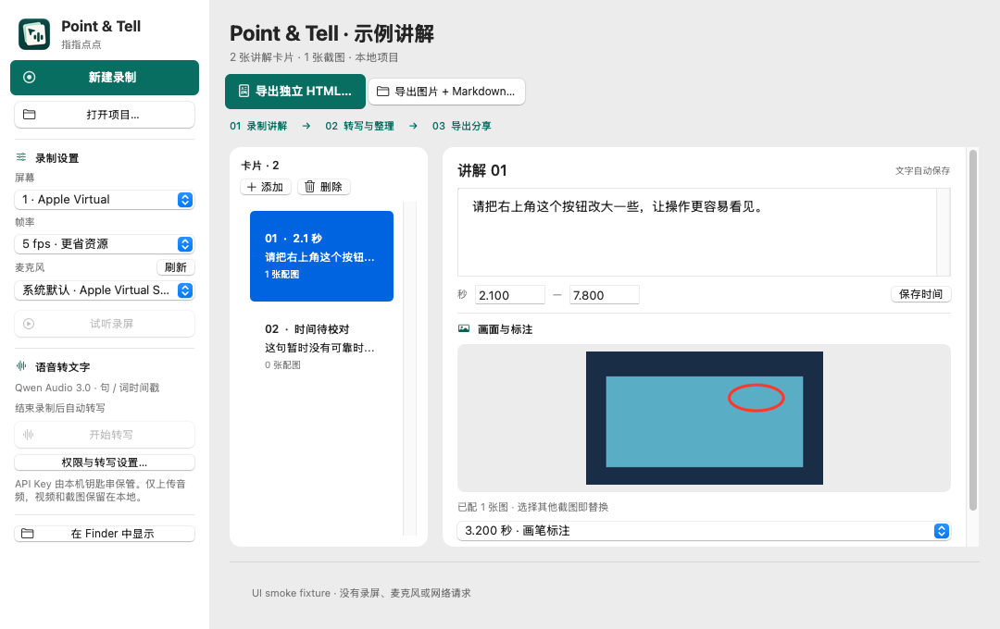

# Point & Tell · 指指点点


Record your screen while explaining what should change. Mark the important moments, draw on a frozen screenshot, then turn your explanation into editable text-and-image cards and an offline HTML file.

**New in v0.3.3:** delete selected cards from the card list or Edit menu; deletion is saved and respected by exports and transcription retries. New Recording and Export Standalone HTML now have consistent solid brand-color backgrounds with white text/icons. See [card deletion and button behavior](docs/CARD-DELETION.md). The [recording startup fixes](docs/RECORDING-STARTUP.md) and [card/pen fixes](docs/CARDS-AND-PEN.md) remain included.



**Native macOS 11+, Intel + Apple Silicon. Source v0.4.0.** No Electron, local language model, account, server, or database.

The v0.4.0 source adds signed application updates: automatic checks, a **检查更新…** menu, and download/install/relaunch through Sparkle. Recording, transcription and export defer updates. See [update setup and release instructions](docs/AUTO-UPDATES.md). A signing-configured release is required to activate updating; ordinary unsigned-for-updates development builds keep it disabled.

## Get the app

<!-- published-release:start -->
[Download v0.4.0 Universal](releases/v0.4.0/Point-and-Tell-v0.4.0-macOS-universal.zip?raw=true) for Intel and Apple Silicon. The signed-update installation ZIP, SHA-256 checksum and exact source/build manifest are in [releases/v0.4.0](releases/v0.4.0).
<!-- published-release:end -->

See the [release notes](releases/README.md) for verification and rollback details. Users on v0.3.3 or earlier must manually install the first update-enabled release once.

The app is ad-hoc signed, **not Apple-notarized**. On macOS 11, extract the ZIP, move the app to Applications, then use Finder → right-click → Open if Gatekeeper asks. Do not disable system security. No Apple Developer account is required to build locally.

## Use

1. On first launch, complete **屏幕录制**, **麦克风**, and **API Key** in the setup window. Connect a display and microphone, grant the two required permissions, enter your key, and acknowledge that recording completion will upload audio to Alibaba Cloud for potentially billed transcription. The workspace stays locked until ready. The key is saved in the local macOS Keychain, never in project files
2. Click **完成设置，进入工作区**. If macOS requests a restart after granting screen permission, save your key and reopen the app. Returning launches recheck current permissions and hardware; missing prerequisites reopen setup. API-key format/configuration is checked locally; model access and quota are confirmed by the first real transcription
3. Choose one screen, 5 or 10 fps, and a microphone; click **新建录制** and choose a new local `.pointtell` folder. The recording toolbar stays above other app windows across desktops and full-screen apps without taking keyboard focus. Check its microphone meter while speaking. Use **标记** (Control–Option–M) or **画笔** for screenshots/annotations
4. Click **结束录制**. The app saves and checks the recording locally, then automatically extracts audio, transcribes with `qwen-audio-3.0-asr-flash`, and creates timestamp-aligned cards. Video and screenshots stay local. Low/invalid audio pauses automatic processing; listen locally before manually continuing
5. Review/edit the cards and screenshots. To remove a card, select it and click **删除**; the saved deletion is respected by export and retry. Failed or cancelled requests remain available through **继续 / 重试转写**; legacy results show **重新转写 · 补齐时间戳**. Manual retries request upload consent and may incur charges; successful timed chunks are reused. No background automatic retry occurs
6. Use the directly visible **导出独立 HTML…** or **导出图片 + Markdown…** buttons. Review screenshots before sharing. Update the key or permissions through **权限与转写设置…** (⌘,)

## If audio or transcription fails

If **New Recording** fails before the toolbar appears, use **复制诊断** in the error dialog. The stage and nested error codes are also saved in a unique `capture-error-*.txt` file in that project. Keep that diagnostic for troubleshooting; a generic “operation could not be completed” message alone does not identify the failing component.

1. After setup, record a disposable, non-sensitive 10-second test: say a few words, mark once, and stop. This starts automatic audio upload/transcription; use **取消转写** to stop further processing if needed (already sent audio cannot be recalled). **试听录屏** itself plays only the local recording
2. If the live meter stays flat or playback is silent, select the built-in mic explicitly, check Microphone permission and macOS Sound → Input. Disconnect/reselect unavailable Bluetooth/USB inputs. The app never silently swaps a missing explicitly selected device
3. A missing/undecodable/empty audio track blocks transcription. A very low RMS level is only a warning, not proof of silence or a speech detector; after listening you can explicitly continue sending low-level audio for that transcription attempt
4. If local speech is audible but transcription fails, read the stage: source inspection, WAV extraction/inspection, request validation, transport, HTTP/provider, or response parsing. Safe HTTP status, provider code and request ID help distinguish service rejection without exposing a key or raw response
5. Keep the project folder for diagnosis. New attempts never overwrite the original MOV or earlier extracted WAVs. Do not send private recordings or API keys in bug reports

This update has not established the cause of the original Big Sur audio report. Native automated tests exercise nonzero AAC movies and resampling, but do not simulate physical microphones or Big Sur permission behavior.

Projects can be reopened with **打开项目…**. Completed transcription chunks with complete word timestamps are reused; failed, pending, or legacy chunks without complete timestamps can be retried after upload consent. Old text is retained until a validated replacement succeeds. No automatic deletion is performed. Keep your original project until you have verified its export.

## Privacy and service compatibility

- Local recording and screenshot processing. No telemetry
- First-run setup asks for consent to automatic audio uploads after each new recording; ASR may incur the provider’s normal usage charges
- Adapter target: `https://maas.qianwenaiapi.com/api/v1/services/aigc/multimodal-generation/generation`, model `qwen-audio-3.0-asr-flash`
- Model request reference: [Qwen-Audio-3.0-ASR-Flash](https://www.qianwenai.com/models/qwen-audio-3.0-asr-flash); final JSON for short audio; finalized sentence/word SSE events for audio ≥60 seconds, with complete-timeline validation.
- Response protocol reference: [Alibaba Cloud recorded-speech recognition HTTP API](https://help.aliyun.com/en/model-studio/fun-asr-flash-recorded-speech-recognition-http-api)
- Provider docs currently describe workspace-specific domains; the requested MAAS endpoint/model are implemented but **not verified by a real paid API request**. Offline fixture tests are not a claim of provider acceptance
- Export contains only selected images and edited cards. Credentials, raw recordings, local absolute paths and ASR diagnostics are excluded
- Screenshots may contain sensitive information. Review before giving exports to anyone or a model

## Build and test

On a Mac with Xcode Command Line Tools / Swift 5.9 or later:

```sh
swift test
ARCH=universal scripts/build-app.sh
open 'dist/Point & Tell.app'
```

The app targets macOS 11.0. A modern compiler/build Mac is required; running the built app on macOS 11 does not require Xcode. The macOS executable embeds Sparkle 2.9.6 (exactly pinned, including the SwiftPM artifact checksum); the core has no third-party dependencies. Core tests can run on Linux with Swift, while AppKit/AVFoundation and Sparkle compilation require macOS. Keep Sparkle's bundled license and resources when packaging.

See [design](docs/DESIGN.md), [test checklist](docs/TESTING.md) and [versioning](docs/VERSIONING.md).

## Current boundaries

One selected monitor + microphone; no system audio, OCR, video editor, AI rewriting, cloud sync or background recording. The screen recording may include the small floating toolbar; explicit bookmarks composite the windows below it, leaving the toolbar continuously visible while excluding it from the saved PNG. Frozen pen controls may appear in the source MOV, but the saved annotated PNG excludes controls.

Compilation and unit tests do not establish runtime permission behavior, screen/audio synchronization on an older Mac, actual hardware-encoder use, or performance on an 8 GB machine. Run the device checklist before relying on the app for important recordings.

## License

No license has been selected. Public repository visibility is not a software-license grant.
