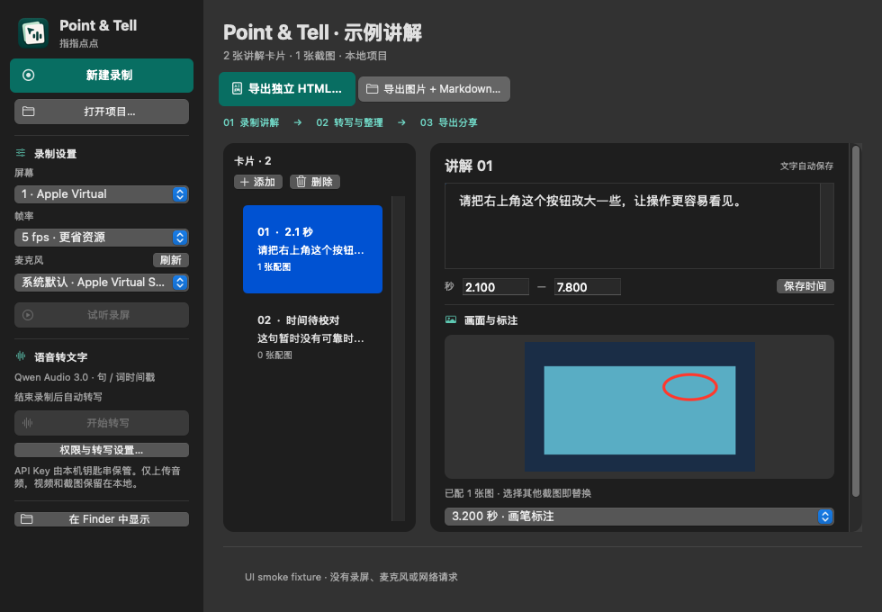

# Card deletion and primary buttons (v0.3.3)

Select a card and use **删除** above the card list or **编辑 → 删除所选卡片…**. Confirm the deletion to remove its text/image association from the reviewed result and exports. The app saves first, then selects the next card (or the previous card when deleting the last one) and renumbers the list. Cancelling or a failed save keeps the card. Deleting a card also discards that card's unsaved timing draft. Original recording, transcription results and screenshot files remain in the project.

After the final card is deleted, the empty state offers Add Card and disables export. The exporter also respects this explicitly empty result if invoked outside the UI: it never falls back to the full original transcript. Deletion metadata is optional, so older projects without it retain their previous transcript-only fallback. Open edited projects in v0.3.3 or newer to retain deletion decisions.

Transcription retries preserve deletion decisions. Surviving cards from the same source sentence keep their text and images. Completely new chunks can still produce cards. If a retried chunk changes a deleted sentence's text/boundary so it cannot be matched reliably, unmatched replacements in that chunk are withheld from automatic card creation; the full transcription stays available in the project. This prevents retry from silently reintroducing removed content.

**新建录制** and **导出独立 HTML** use a solid forest-teal background (`#0F5C4F`) and white text/icons. Native button cells draw the brand background consistently in light/dark appearances and inactive windows. Pressed and disabled states remain distinct, and native action dispatch, focus and accessibility are retained. Secondary actions retain their standard appearance.

The 0.5.2 source fixes the pressed foreground: text and symbols stay white with 82% opacity over the darker pressed background. The title draws directly in AppKit's title frame with an explicit foreground, bypassing its additional highlighted text dimming; the native symbol receives the same white tint. The UI fixture saves `primary-buttons-pressed-light.png` and `primary-buttons-pressed-dark.png` for visual verification.

When recording finishes, the app now activates and makes the workspace the front key window, restoring it if hidden or minimized. Recording failures use the same presentation before showing the error. The workspace keeps its normal window level; the recording HUD remains nonactivating and does not steal focus during capture. The native fixture verifies returning from a hidden/inactive app and dismissing the HUD. No project format, migration, recording timing or transcription behavior changes are involved.

Regression coverage includes deleting one of several cards from a shared transcript, deleting the final manual/automatic card, save/reopen, HTML/Markdown/JSON exclusion, retry with changed sentence boundaries, new chunks, adjacent selection, busy state and a real failed-write rollback. Existing native audio, pen, screenshot picker and offline export checks remain in place.

Native fixture screenshots:

