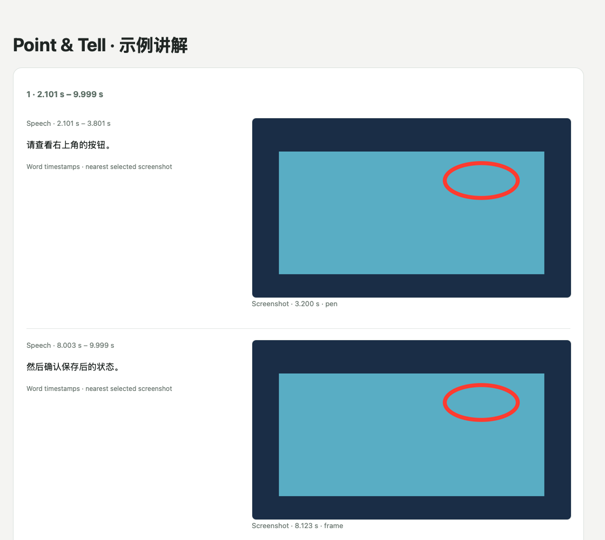
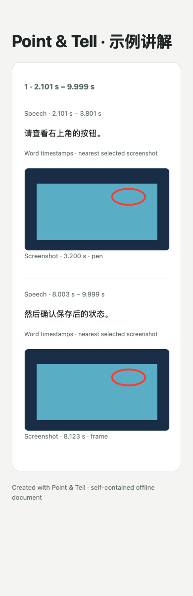

# Timestamp-aligned exports

HTML and Markdown share one alignment plan, also included as `cards[].moments` in export JSON schema 2. Source project schema remains backward compatible.

- Retain final provider word timestamps in milliseconds, convert to seconds, and apply the audio chunk offset once to sentences and words. Final SSE corrections replace earlier results with the same sentence identity.
- Within each reviewed card, show the selected screenshots chronologically with their corresponding speech beside them (stacked on narrow screens). Keep each word whole; use its time midpoint to select the closest screenshot. Equidistant words go to the later screenshot. Equal-time screenshots share a passage.
- Speech labels use actual first/last word times. Screenshot labels use the actual captured frame time. Both display three decimal places. Image selection is temporal association, not a claim that a screenshot itself has word-level accuracy.
- Preserve every original character, including spaces and punctuation, exactly once. Never split by character count or invent intermediate times. A selected screenshot without assigned speech stays visible.
- If words are absent, invalid, incomplete, or no longer agree with edited text/times, keep the reviewed passage and selected pictures together and label the limitation. Manual selections are preserved; missing image files warn without rematching the speech to another image.
- Short non-streaming replies may contain full text but timing for only the final sentence. Preserve that final sentence's real timing; leave preceding text explicitly untimed. Never assign the final sentence's time to the entire recording.

Old projects without word timestamps still open. They retain sentence-level or manual alignment; exporting cannot recover timestamps that were never stored. The app does not silently re-upload audio or overwrite reviewed text to repair older results.

The two primary actions are directly visible above the workspace: **导出独立 HTML…** and **导出图片 + Markdown…**. Both disable while busy and when there is nothing to export. The folder contains images, README.md, offline index.html, and sanitized project.json.

Provider schema: https://help.aliyun.com/en/model-studio/fun-asr-flash-recorded-speech-recognition-http-api (sentence/word timestamps and finalized SSE events). Model and request/upload behavior are unchanged.

Verification covers multi-image interleaving in HTML/Markdown/JSON, chunk offsets, millisecond boundaries, equal-time images, Unicode/punctuation, missing/invalid timestamps, manual edits, old project decoding, and both visible buttons in compact/light/dark AppKit rendering.

## Rendered export

The actual exported fixture passes desktop and 390px WebKit checks for speech/image grouping, embedded-image loading and horizontal overflow. [Offline HTML fixture](examples/timeline.html).

