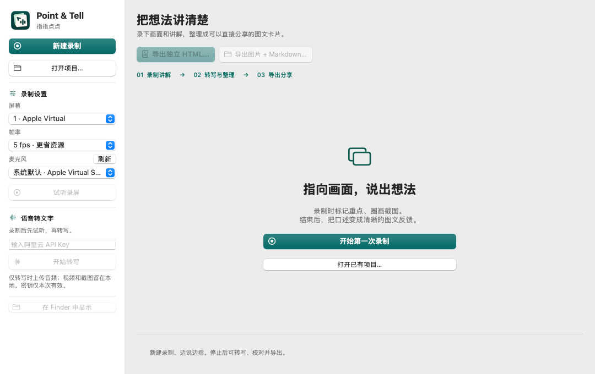
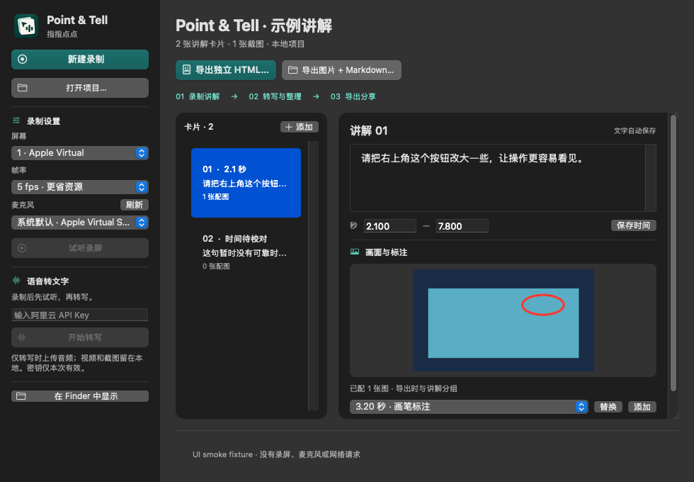

# Native workspace · v0.2.1

The app now organizes the task around **record → review → share**. It remains dependency-free AppKit on macOS 11+; capture, WAV inspection and provider request behavior are unchanged.

## Workspace

- **Sidebar:** chosen app identity, new/open project, screen/frame-rate/microphone settings, local playback and opt-in transcription. Settings scroll on short displays.
- **Header:** project title, card/image counts and two directly visible export buttons: **导出独立 HTML…** and **导出图片 + Markdown…**. Both remain visible in the compact layout.
- **Card list:** numbered summaries with timing and image counts, native keyboard selection and an add action.
- **Editor:** automatically saved text, explicit timing fields, large screenshot preview, attached-image count and image assignment tools. The editor scrolls independently on smaller windows.
- **Status:** persistent two-line result/error feedback and an indeterminate progress indicator. Long status messages remain available in their tooltip.
- **Empty states:** new users get a clear start/open action; existing projects without cards offer manual authoring and local playback.

## Visual system

SF system typography, SF Symbols, a forest-teal accent derived from the selected C logo, semantic AppKit background/text colors, 12–22pt spacing and modest rounded surfaces. The primary recording action is emphasized; destructive/stop actions stay distinct. Controls retain native focus rings, keyboard behavior and accessibility labels. The minimum content size is 980×680; the initial size is 1080×760.

## Interaction details

Text saves to the local project as it changes. Timing drafts are validated and committed before card changes, project replacement, export and quit; invalid input stays visible for correction. Selecting a card without assigned images shows an empty preview. Choosing a screenshot previews it, while Add/Replace changes the exported selection. Busy states disable conflicting actions and show the existing cancellation control during transcription. File menu shortcuts: ⌘N new recording, ⌘O open, ⌘S save card, ⌘E export HTML. Global marking stays ⌃⌥M.

## App icon

`Resources/AppIcon.icns` is installed into `Contents/Resources` by `scripts/build-app.sh`; `CFBundleIconFile` references it before ad-hoc signing. `Resources/Brand/AppIcon-1024.png` and `AppIcon.appiconset` retain the chosen design's source raster and Xcode assets. The final app bundle icon is checked while packaging.

## Verification

The macOS CI matrix compiles both architectures, runs the existing core/audio checks, packages a signed Universal app and renders native UI fixtures. `--smoke-test` captures light review, compact dark review, empty project and welcome screens, and checks text persistence, timing commits, empty previews and busy-state availability. These are app view renders, not desktop captures. They do not replace real-device recording permission, keyboard/VoiceOver or minimum-OS usability checks.

## Native screenshots

Rendered by the actual AppKit application on the macOS CI runner ([source build](https://github.com/kejun/point-and-tell/actions/runs/37000170176)). The example recording image is a synthetic fixture; no private screen, microphone or API data is used. The runner's display constrains these captures to 680pt content height.

### Welcome

### Review

### Dark / compact

