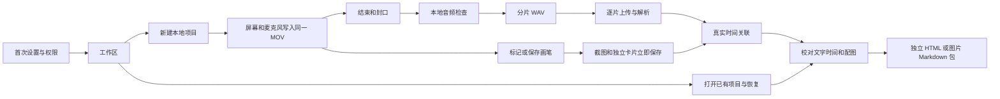
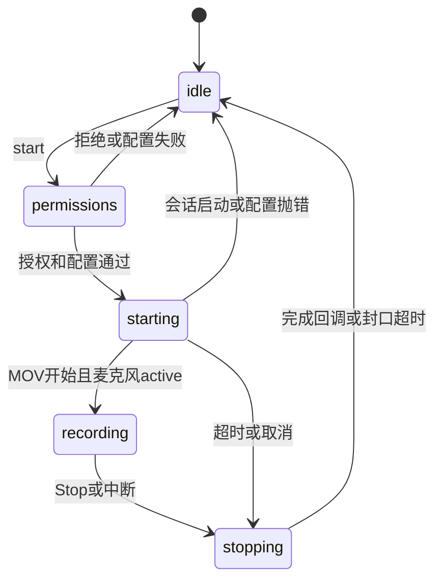
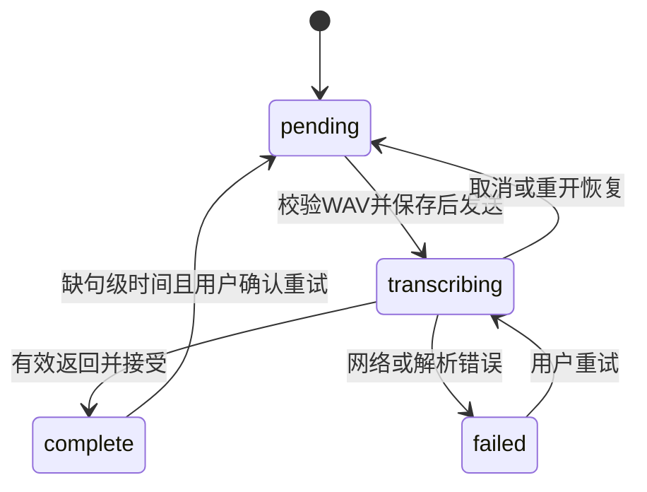

# Point and Tell 逻辑链路与使用链路

**重要：一切以最新代码的实际实现为准。本文和仓库中其他文档都可能滞后；如描述与最新代码冲突，以代码为准，并重新核对对应提交的测试证据。** 本文是固定时间点的代码审阅快照，不是随开发自动更新的功能承诺。

这份文档面向产品梳理、开发协作和验收：把用户从首次打开到导出分享的操作，与实际代码、文件、状态和时间轴连起来，再按证据找出断点。它记录当前实现，不把设计意图、测试替身和真实设备表现混为一谈。

**原审阅快照的主线结论：当时应用已经是“用户主动截图先成卡，再用真实语音时间回填讲解”的流程。** 录制、截图、转写和导出各自有保存与失败边界；最需要一起核对的是这些边界，而不是只测一次顺利录制。该快照时暂停功能仍在独立 PR 中，正式下载包又落后于主线，三者必须分开讨论。

## 0 最新集成与设备反馈（2026-10-03）

[PR #14](https://github.com/kejun/point-and-tell/pull/14) 与 [PR #16](https://github.com/kejun/point-and-tell/pull/16) 已合入 main，集成提交为 [`93c81c1`](https://github.com/kejun/point-and-tell/commit/93c81c19ebb75414b2cdffee501e2f21a96e1aca)，源码为 **0.5.1 / build 13**。除本文件和 AGENTS.md 两份后加入的文档外，该集成树与已构建测试的 `1d41ba5` 文件内容一致。

- **讲解归属已改为完整分段。** K 张录制截图对应 K 段连续讲解，文字按原顺序恰好分配一次；标点、停顿和真实时间只帮助选择分界，距离远、无时间或歧义不会拒绝分配。新增首句/末句移动；手动修改和删除记录继续受到保护。仅有句时间的文字分段仍引用原句范围，不生成虚构词时间。完整语义、旧项目本地重算和回归入口见 [截图卡片说明](SCREENSHOT-CARDS.md)。
- **Intel 真机反馈通过。** 北京时间 2026-10-03 15:04，用户在收到 0.5.1 Universal 测试包后报告：“我在英特尔芯片的真机上测试完全没有问题。”这是用户实际使用反馈，未补造系统版本、专项 probe 日志或全套性能矩阵。
- **CI 证据保持原状。** [37104362726](https://github.com/kejun/point-and-tell/actions/runs/37104362726) 的两个架构各 182 项核心测试、Universal 构建、更新安全、AAC 和新增分段 UI 检查通过；arm64 全任务通过，Intel 暂停 probe 仍失败（暂停画面进入 MOV）。用户随后确认 0.5.1 真机无问题，要求关闭 [#12](https://github.com/kejun/point-and-tell/issues/12) 并发布正式版。issue 已关闭；本版本采用 [源码固定的真机验收](PAUSE-RECORDING.md#051-正式发布验收)，保留探针失败及发布警告，其他失败仍阻止发布。
- **源码集成与正式分发仍分开。** 用户验证的是 ad-hoc 签名的 0.5.1 Universal 测试包；本次合并没有发布正式更新，现有 `releases/` 与签名 feed 继续保留原版本。

下面第 1 节及后续主体保留原固定提交的审阅快照，用于追溯当时的链路与风险；其中旧匹配算法、暂停分支状态及“当前”版本措辞应按该快照理解，不能覆盖本节与最新源码。其他审计发现没有因为本次 Intel 反馈被自动视为修复。

## 1 阅读范围与版本快照

主线及待合入分支最后核查：2026-10-03 03:28 UTC。源码引用固定到提交，不随分支移动；PR 和 CI 链接反映对应提交的历史证据。本文只新增文档，不修改功能、发布版本或合并开发分支。

| 层次 | 核查对象 | 可以据此说明什么 |
| --- | --- | --- |
| 当前 main | `1ff2b1d6ec1aa24ed8ac824178e9ca005d3d3ea6`，源码 0.4.1 / build 11 | 本文未特别标明的实际链路；#13 已合入截图优先卡片 |
| 待合入暂停方案 | [PR #14][pr14]，发布前最新观察头 `b57ab275a0e14f469294c7140b085cd5f1861bcf`；时钟变更审阅 `c58d2fb2e3efd9b261b4d39339d0bacd0c192765`；另保留此前审阅头 `02f151eba1e18a7357e6a93f7c5b85d0991fb1d2` 的失败证据，源码 0.5.0 / build 12 | 第 9 节中的拟议状态、代码与该提交 CI；不能当作 main 已有功能 |
| 已分发包 | `releases/v0.4.0/`，0.4.0 / build 10；构建来源 `2545e0d487f5f2d44918977aa43dc7a89766404f` | [build.json][release-manifest] 与 [更新清单][appcast] 证明分发版本；不代表用户实际安装版本 |

main 的 [CI 37089818034][main-ci] 已成功。PR #14 的历史审阅提交 `02f151e` 对应 [CI 37092097945][pause-ci] 失败；`c58d2fb` 的 [CI 37092800518][pause-latest-ci] 与最新头 `b57ab27` 的 [CI 37093004240][pause-publish-ci] 均已失败；本文没有将它们的失败自动归为旧漂移根因，详情见第 9 节。仓库使用 `releases/` 目录分发，不能仅用 GitHub Releases 页面有无条目判断是否已发布。

证据等级：

- **已观察失败**：具体运行、提交、日志或产物能复查
- **静态确定行为**：代码分支和数据变更可直接确认，尚不等于在用户设备复现
- **代码风险**：存在需要构造条件验证的路径，不直接称为已发生故障
- **待实机验证**：涉及系统权限、物理设备、旧系统、服务端或性能，没有足够证据下结论

## 2 总体闭环



文字版：设置就绪 → 新建项目 → 录制期间主动截图成卡 → 结束并检查媒体 → 本地抽音 → 逐片上传 → 时间关联 → 人工校对 → 导出。打开旧项目走本地加载、恢复和迁移，不自动上传。没有主动截图时，ASR 原文仍存在，但不会自动补截图或凭句子新造截图卡片。[启动与结束][app-capture]、[打开项目][app-open]、[截图成卡][screenshot-cards]、[导出入口][app-export]

### 2.1 模块职责

| 模块 | 职责与边界 |
| --- | --- |
| `AppDelegate` | AppKit 页面、菜单、操作门禁、项目内存副本、串联录制 / ASR / 导出；体量较大，需特别核对跨异步回调的状态 |
| `SetupWindowController`、`WorkflowReadiness`、`APIKeyStore` | 权限 / 硬件 / Key / 上传同意，Keychain 保存；Key 格式通过不代表服务权限通过 |
| `RecordingEngine` | 独立串行队列管理 AVCaptureSession、屏幕和麦克风输入、同一 MOV 输出、时钟、电平、错误与封口 |
| `VisualCapture`、`DrawingOverlay`、`RecordingToolbarPanel` | 单次屏幕图、冻结图画笔、手动 MOV 取帧、置顶 HUD；不承担 ASR |
| `AudioInspector`、`AudioChunker` | 本地解码、电平检查、保留 MOV 坐标的 16 kHz WAV 分片；不上传视频 |
| `ASRClient`、`ASRResponseParser`、`ASRProjectUpdates` | 请求校验 / HTTP / JSON-SSE 解析 / 逐片结果替换；无后台自动重试 |
| `ScreenshotCardMatcher`、`ProjectManifest` | 截图事件身份、时间归属、人工修改保护、删除抑制记录 |
| `ProjectStore` | 路径与数据校验、原子 manifest 保存、崩溃状态恢复；不自动清理媒体 |
| `ProjectExporter` | 从当前卡片快照导出；不重新跑 ASR、不自动抽帧、不上传 |
| `UpdateController`、`UpdateSessionGate` | Sparkle 更新提醒、工作互斥和退出前保存；安装包签名与发布脚本另成链路 |

核心入口：[项目模型][project-model]、[录制引擎][recording-engine]、[ASR][asr-client]、[导出器][exporter]、[更新器][updater]

## 3 用户使用链路

### 3.1 首次打开与再次打开

1. 创建菜单、主窗、录制工具条和标记快捷键；启动更新控制器，显示设置窗口
2. 后台读取本机 Keychain。已经完成设置的用户仍要重新检查当前屏幕、麦克风、权限和保存的上传同意；条件不齐则留在设置页
3. 用户分别授权屏幕录制、麦克风，输入单行 Key，并勾选“录制结束后，自动上传音频并转写”
4. Keychain 保存成功且所有条件满足，才进入工作区；被系统要求重启时，需要退出后重新打开
5. 应用重新成为前台且不忙时再次检查就绪条件，撤权或设备变化可能让用户回到设置页

Key 只做本地非空及可打印 ASCII 格式检查；没有启动即发送的验证请求。接收方为 `maas.qianwenaiapi.com`，模型为 `qwen-audio-3.0-asr-flash`，可能按量计费。音频上传同意和设置完成标记在 UserDefaults，密钥在 Keychain，不在项目和导出物中。[设置检查][setup]、[启动门禁][app-launch]、[就绪条件][readiness]、[Keychain][keychain]

**产品限制：目前“查看旧项目 / 编辑 / 导出”也被完整设置门禁锁住。** 没有麦克风、撤销录屏权限、不提供 Key 或不同意自动上传时，没有仅本地整理的入口。这是代码确定的现状，是否拆出本地模式需要产品决定，见 F4。

### 3.2 新建项目与开始录制

1. 先提交当前卡片有效时间和未保存文字；停止已有本地试听
2. 选择屏幕、5 fps 或 10 fps、系统默认或指定麦克风；选择新的 `.pointtell` 目录
3. `ProjectStore.create` 创建目录、`frames/`、`audio/` 和 `project.json`；不覆盖已有 manifest。项目记录拟写入的 `recording.mov`、显示器、fps，并启用截图卡片模式
4. 引擎再次检查权限、显示器、麦克风、目标不存在、磁盘可用空间，再配置捕获图
5. `didStartRecording` 到达且麦克风连接 enabled / active 后，才向 UI 报告成功；此时 arm 一次自动转写门闩，主窗隐藏、HUD 显示
6. 启动失败回到主窗，保留项目与已写文件，显示分阶段错误及复制诊断入口；不会进入自动转写

录制选择“系统默认”会在启动时解析设备；明确指定设备但已拔出时失败，不偷偷替换。录制保存到用户选择目录，不是云端项目。[App 启动][app-capture]、[引擎输入与磁盘预检][engine-config]、[麦克风成功条件][engine-meter]

### 3.3 录制中的控制与主动截图

- HUD 是不抢键盘焦点的非激活面板，可拖动、跨 Space、辅助全屏空间显示；前台和 Space 变化及计时器会恢复前置顺序。操作系统安全界面仍由系统控制；真机多屏 / 全屏覆盖待验证
- 工具条显示媒体时钟和麦克风电平。电平是音量提示，不证明有人声，也不证明最终文件和服务器结果正常
- **标记** 或 Control–Option–M：等待 120 ms，截图前后分别读取录制时钟，以中点作为截图时间；保存一个截图事件和一张独立卡片
- **画笔**：同样先取得冻结屏幕图，再打开可接收笔迹的面板。撤销、清空、取消或保存均在该冻结图上操作；保存一次画笔会话生成一张卡片，多条笔划不生成多卡；取消不生成卡片
- 源 MOV 可能包含工具条或画笔界面。主动截图用 HUD 以下的窗口合成来排除 HUD；画笔最终 PNG 由冻结图与笔迹渲染，不包含画笔控制栏
- 画笔期间麦克风继续录制。截图原始时间不改成保存时间；另记会话开始和结束时间，让绘制期间的语音有据可关联

目前 main 没有暂停按钮和原生暂停调用，即使持久化枚举已有 `paused`。不要把此枚举当作功能已上线。[截图入口][app-anchors]、[画笔实现][visual-capture]、[HUD][toolbar]、[时间字段][project-model]

### 3.4 结束录制与自动转写

正常 Stop 的顺序不能颠倒：

1. 若画笔仍打开，先执行其保存；失败则保持画笔，不能悄悄丢弃后继续结束
2. 禁用 Stop、停止 UI 计时，项目标为 `finishing`，调用引擎停止；HUD 此时仍显示，直到停止完成回调才隐藏并显示主窗
3. 引擎先 `stopRecording`，等 `didFinishRecording`；之后才 `stopRunning`，避免提前停会话破坏封口
4. UI 后台运行本地 `AudioInspector`；检查成功才读取最终媒体时长并保存 `complete`，检查失败保存 `interrupted`
5. 音轨可解码、有样本、非低电平、当前设置就绪时，消费该录制的一次自动转写资格
6. 安静 / 无音轨 / 损坏 / 录制失败 / 保存失败停在本地复核；没有自动无限重试。打开旧项目也不 arm 自动资格

**main 的这里主要检查音轨，不等同于完成视频轨逐项验收。** PR #14 增加最终视频检查，必须按拟议代码单独看。两秒 MOV fragments 只提高部分文件恢复机会，不能承诺崩溃必定无损。[结束流程][app-capture]、[封口与错误][engine-stop]、[音频检查][audio-inspector]、[一次性门闩][readiness]

### 3.5 本地复核与手动重试

“试听录屏”只用本地 AVPlayer，不上传。低电平判断为 RMS < −60 dBFS；peak 仅作为报告值。这是幅度检查，并不是 VAD 或语音识别；安静讲话也可能触发。

手动开始 / 继续 / 重试时重新说明接收方、模型、音频内容和可能费用，再请求上传同意。已存在 WAV 的项目逐片检查 WAV，不因原 MOV 损坏就丢弃可用的分片。首次抽音从 MOV 创建新的 `audio/extraction-UUID/` 目录，旧尝试不覆盖。自动流程遇到后续低电平分片也会停住；手动流程可显式允许本次尝试的低电平分片。[ASR 入口与同意][app-asr-prep]、[逐片 WAV 检查][app-asr-send]、[音频分片][chunker]

取消时：网络请求可取消，本地检查 / 抽音一般等当前本地步骤完成再响应；已发送给服务商的音频无法撤回，可能已经计费。完成分片和原媒体保留，失败不会后台悄悄再发。[取消与完成][app-asr-finish]、[网络完成互斥][asr-client]

### 3.6 校对卡片

- 编辑器以 `reviewCards` 为工作成果；`transcripts` 保留识别来源。修改卡片文字不改写供应商源句
- 文字逐次自动保存；开始 / 结束时间在结束编辑、切卡、保存或后续操作前校验，可清空，不允许负数、非有限数或倒置。保存失败会提示并阻止依赖该保存的后续操作
- 配图下拉选择会立即替换当前卡片的 `frameIDs` 并保存，再次选择即替换；失败回滚旧选择。当前 UI 保存一张所选图，模型可保留旧项目多图；没有额外 Add/Replace 确认步骤
- 录后“提取截图”使用指定媒体秒数，记录实际解码帧时间，只更新选中卡片，不生成额外卡片；PNG 或 manifest 失败保留原选择
- 手动文字、时间、图片修改将卡片标为 `userEdited`，重试不会覆盖；“关联详情”提示展示的是上次自动关联依据，不是假装人工修改后重新自动对齐
- 删除会确认，先保存副本再替换内存；删除的是整理卡片与导出选择，原 MOV、WAV、PNG 和原始转写不删除。删除记录抑制重试重建；删完全部卡片不会自动恢复成卡
- “原始转写”可见未关联、歧义和无时间戳内容；即使没有卡片也可从文件菜单查看。不会把未关联内容偷偷插入导出

来源：[编辑与时间保存][app-edit]、[删除与手动取帧][app-review]、[原始转写与关联详情][app-association]、[删除模型][review-grouping]

### 3.7 导出与分享边界

| 导出类型 | 实际产物 | 保存与失败 |
| --- | --- | --- |
| 独立 HTML | 单个 HTML，内联 CSS、所选 PNG 的 Base64、当前卡片文字和时间 | 项目之外的本地路径，原子写入；由保存面板处理既有文件选择 |
| 图片 + Markdown | 新目录内 `README.md`、`images/*.png`、`index.html`、精简 `project.json` | 拒绝既有目标目录；先写同级 staging，全部完成后 rename |

导出前 `commitTiming` 提交时间草稿并处理已知编辑保存失败，然后在后台用当前项目快照生成；入口没有额外无条件完整 `persist`。截图卡片模式下 `cardsForExport` 直接返回保存后的卡片数组，编辑器 / HTML / Markdown 不重新采用三套成卡规则。旧的 transcript-first 纯核心调用仍有历史分组逻辑，但应用打开项目已先迁移，不能把旧实现当成今天新录制路径。[导出入口][app-export]、[卡片导出分支][review-grouping]、[导出准备][exporter]

导出只包含当前选中的图片与卡片，不包含 Key、原 MOV/WAV、ASR 诊断、项目绝对路径、未采用的全部原始转写。截图和用户自己写入的文字仍可能敏感，分享前必须人工检查。HTML 无脚本和远程资产，有限制 CSP，正文文字经过转义；Markdown 也做转义。导入项目关联元数据的 HTML 属性转义仍有缺口，见 F9。缺图会有 warning 和可见占位，损坏 PNG / 路径越界 / 超预算会失败，而非假装完整成功。[导出安全与限额][exporter]

## 4 数据模型与存储真相

```text
用户选择的项目.pointtell/
  project.json                       可恢复的工作状态与关系
  recording.mov                      原始屏幕和麦克风录制
  frames/<UUID>.png                  主动截图、画笔结果、手动取帧
  audio/extraction-<UUID>/chunk-*.wav 本地派生音频分片
  capture-error-*.txt                录制错误诊断（发生错误时）
```

目录是普通本地项目目录；不是可直接替代分享包的脱敏格式。发给他人整个项目会同时暴露原录音 / 录屏、未选图片、原始转写等，不能把“导出只包含已选卡片”的保证套到整个目录。[项目存储][project-store]、[录制失败处理][app-failure]、[导出 schema][exporter]

| 数据 | 身份与事实来源 | 可变性 / 恢复规则 |
| --- | --- | --- |
| `RecordingInfo` | MOV 相对路径、最终时长、屏幕、fps，可选音频路径 | 新录制新目录；不向旧 MOV 追加 |
| `VisualAnchor` | UUID、截图 `timestamp`、PNG 路径、kind/source、采集前后观测、画笔区间 | 每个主动事件独立；相同时间也不合并；手动提取来源不同 |
| `TranscriptSegment` / `TranscriptWord` | 供应商文本与真实句 / 词时间，已换算到 MOV 坐标 | 不凭到达顺序、字数或均分生成时间 |
| `ASRChunk` | WAV 路径、index、MOV 起点、时长、状态、源句、安全诊断 | 每片完成后保存；失败 / 取消旧句不立即删除 |
| `ReviewCard` | 独立卡片 ID、可选源截图 / 源句、文字、frameIDs、讲解时间 | 用户成果；`generatedContent` 与 `userEdited` 判断能否自动回填 |
| `ScreenshotAssociation` | 实际匹配句 / 词、偏移、粒度、理由、歧义状态 | 解释一次时间关联，不证明语义正确 |
| `ReviewEdits` | 抑制的源句 ID 与截图 ID | 删除决定持续有效；源文件仍在 |
| `ProjectManifest` | schema 1、项目 ID、以上数组、captureState、可选 screenshotCardVersion | JSON 原子替换；新增可选字段兼容读取旧格式 |

`ProjectStore` 校验 schema、重复 ID、相对路径、有限且非负时间、起止顺序和归一化指针；拒绝 `..`、绝对路径、URL、反斜线、项目内部符号链接。加载不保证所有媒体均存在或可解码，相关动作仍要检查；只读 / 磁盘故障可能使恢复状态的保存失败，不能称为“总能打开”。[模型][project-model]、[存储和恢复][project-store]

**原子范围是单次 manifest 替换，不是整个目录事务，也不是跨进程锁。** 图片先写再保存 manifest；手动取帧失败会移除新文件，主动截图失败可能保留未被 manifest 引用的 PNG。不要用两个应用进程同时编辑同一目录；`ProjectStore` 明确要求单一串行拥有者，但不提供项目锁。[保存实现][project-store]、[主动图片保存][app-anchors]、[手动图片保存][app-review]

### 4.1 打开旧项目与中断恢复

1. JSON 解码并校验；清理不安全诊断字段
2. `recording / paused / finishing / processing` 遗留状态转为 `interrupted`；`transcribing` 分片转为 `pending`
3. 应用采用 `screenshotCardVersion=1`；已有卡片整体标为人工保护，保留原文、时间、配图和顺序
4. 若旧项目有删除记录而无法反推全部截图关系，保守抑制未被已有卡片代表的旧截图，不让删掉的内容复活
5. 对未表示且未抑制的主动截图补成独立卡片；历史自动 frame 不作为新的主动截图事件
6. 保存迁移，再尝试从现有 MOV 更新可读时长；不自动上传、不自动补图、不续写旧 MOV

schema 号仍为 1，不等于旧版程序完全理解所有新字段。回退前保留整个旧项目备份，避免旧版保存时丢掉它不认识的可选元数据。[加载][app-open]、[迁移与 reconcile][screenshot-cards]、[恢复][project-store]

## 5 时间坐标与截图到讲解的关联

### 5.1 只允许一次坐标换算

| 时刻 / 区间 | 坐标 | 使用方式 |
| --- | --- | --- |
| 用户点按钮的墙钟 / 系统 uptime | 控制和诊断时间 | 只用于延迟、watchdog、健康检查；不能直接当视频时间 |
| `recordedDuration` | 正在录制输出的媒体时钟观测 | HUD、截图前后观测、画笔结束；main 不用墙钟计时 |
| 截图 `timestamp` | 前后媒体时钟观测的中点 | CGWindowList 图像没有精确视频帧 PTS，不能宣称毫秒级同步 |
| `annotationStartSeconds` / `endTimestamp` | 同一媒体时钟 | 区分冻结图形成时刻、画笔可用时刻、保存时刻 |
| AudioChunker sample PTS | 原 MOV 时间轴 | 保留首音轨非零起点；后续真实缺口补零，重叠裁剪 |
| `chunk.startSeconds` | 原 MOV 坐标 | WAV 第一个样本对应的录制位置，非“第几个请求 × 180” |
| 供应商句 / 词毫秒 | 上传 WAV 内相对时间 | `/1000 + chunk.startSeconds`，只加一次 |
| 卡片讲解时间 | 已分配的真实语音或用户编辑 | 不是截图时间，也不是网络返回时间 |

例如分片从 MOV 的 180.25 秒开始，服务端给出 1500–2400 ms，项目里存 181.75–182.65 秒。不能再叠加音轨起点、录制启动耗时或暂停墙钟。录后手动抽图记录 `AVAssetImageGenerator` 返回的实际时间。[ASR 换算][asr-models]、[抽音 PTS][chunker]、[截图时钟][app-anchors]、[手动取帧][visual-capture]

5 fps / 10 fps 的名义帧间隔约 200 / 100 ms，加上采集缓冲和 OS 行为，不等于可靠的统一误差上限。显示三位小数只说明存储精度。先讲后标、绘制中讲、先标后讲都必须用实际样本检查，不能靠移动显示时间掩盖偏差。

### 5.2 当前 screenshot-first 匹配算法

1. 选取录制标记 / 录制画笔锚点，按截图时间稳定排序，同时间仍保留不同事件
2. 有完整且覆盖源文的词时间就使用真实词及原文切片；否则有句时间则把整句作为不可拆单元；无时间文本不参与时间归属，但保留原文
3. 对相邻截图，优先在前张截图的活动终点（bookmark 为截图时刻，pen 为保存时刻）与下一截图之间寻找最长且超过 0.6 秒的真实语音间隙；否则使用顺序中间边界。边界只用于决定归属，不写成伪造的语音时间
4. 候选限于距离截图时刻或画笔活动区间不超过 12 秒的语音单元。12 秒是检索限制，**不是只向前 12 秒，也不是语义相关性证明**
5. 优先看真实覆盖 / 画笔区间重叠与相邻单元格；同一语音单元最多给一张卡。完整词可以按真实词边界分配，句级单元跨多图时不能均分
6. 同时重叠多张、同时间不同事件、整句跨多张而不能唯一确定时，保留图卡、标记需校对，把原文留在“原始转写”，不复制到多卡
7. 每张图卡 ID 与截图事件绑定；无语音、无可靠时间、ASR 取消 / 失败都不删除图卡
8. 重试只更新完全未修改的自动内容；删除的截图仍参与时间边界，但其卡片不重建，防止将已删讲解挤到邻卡

因此链路支持“先讲再标”“边画边讲”“先标再讲”，但只在时间规则能唯一归属时自动填入。没有语义模型在判断用户到底指的是哪个控件。大段远离任何截图的语音可能不在卡片里，导出前必须看原始转写。[完整匹配规则][screenshot-cards]、[原文切片与导出时序][alignment]

### 5.3 历史实现不能混入当前结论

`FrameMatcher` 的 pen > bookmark > 普通 frame、长句多窗口及历史截图上限，属于旧 transcript-first 路径。当前每个主动截图一个稳定事件，不受旧算法六张匹配上限限制。`ReviewCardGrouping` 对 sourceAnchorID 卡片直接返回，截图模式导出也不重排。旧文档中的自动抽帧、旧卡自动按词重组、所有成功片段必须有完整词时间，需要按第 11 节的差异理解。[历史匹配器][frame-matcher]、[导出卡片选择][review-grouping]

## 6 状态和异步顺序

### 6.1 主线实际录制状态



这是 main 的引擎 phase，不是 `ProjectManifest.captureState`。UI 另有 `processingBusy`、`pendingScreenshot`、`drawing`、`workflowReady`、更新会话锁和取消标记。不能把其中任一布尔值当作完整生命周期。[引擎][recording-engine]、[UI 门禁][app-gates]

主线 manifest 常见状态为 `idle → recording → finishing → complete`，失败变为 `interrupted`。`paused / processing / failed` 虽在枚举中，但不代表主线 AppDelegate 会沿这些节点执行；当前 ASR / 导出忙碌主要由内存旗标和 chunk 状态表达。强退后恢复依赖 manifest 与分片记录，不能只看 captureState 推断所有后台工作。[状态定义][project-model]、[录制写状态][app-capture]、[ASR 完成][app-asr-finish]

### 6.2 转写分片状态



分片串行处理，不并发上传。请求前先持久化 `transcribing`，响应成功后换算一次 offset、接受新句、reconcile 卡片、保存，再处理下一片。URLSession 请求对象用锁保证终结回调最多一次、释放会话；拒绝重定向，避免把 Key 或音频转发到意外域名。UI 使用 busy 门禁阻止切换项目，但回调上下文主要仍依靠当前项目和索引，后续扩展并行任务时需继续保护项目 / 请求身份。[发送路径][app-asr-send]、[网络层][asr-client]、[接受结果][asr-project]

### 6.3 不能跳过的先后依赖

| 动作 | 必须先满足 | 失败后的真实边界 |
| --- | --- | --- |
| 主窗变为录制 HUD | `didStart` 且麦克风连接 active | 不是点下“新建”就成功 |
| 正常 Stop | 打开的画笔保存成功 | 保存失败保留画笔并停止后续结束 |
| 结束捕获会话 | MOV `didFinish` 或明确超时处理 | 不先 stopRunning 来冒充封口 |
| 自动上传 | 最终音频检查、manifest 保存、一次性门闩及同意 | 静音 / 失败 / 取消不自动再发 |
| 替换旧 ASR 片段 | 新响应通过接受检查 | 旧句通常留在分片；异常边界见 F1 |
| 手动取图 / 删除提交 | 新 manifest 保存成功 | 保存副本后替换，保留旧 UI 结果 |
| 导出 | 提交有效编辑、处理已知保存失败、只读快照 | 不重选图片或重新转写 |
| 开始更新 / 安全退出 | 没有活动工作，再完整保存 | 保存失败必须拒绝退出 / 更新 |

### 6.4 服务端响应与成功的实际含义

请求对小于 60 秒的 WAV 使用 JSON，对不少于 60 秒的 WAV 启用 SSE；请求上限为 300 秒及 10,000,000 字节 Base64 data URI，生产分片最长 180 秒。180 秒按样本数量硬切，不按句子或静音分割，也没有跨片重叠识别与词级拼接，跨片语句的识别质量需真实样本验证。[请求构造][asr-client]、[WAV 校验][asr-wav]、[分片][chunker]

当前 screenshot-first 成功契约允许有非空最终正文而缺少真实时间：chunk 可以 complete，原文保留供人工校对。`needsTimestampRetry` 只检查 complete 片段是否无句子或某句缺有效句时间；已有句时间但缺词时间不会仅为补词再次上传。完整词时间仍是细粒度拆词关联的条件，不能混成“转写成功的必要条件”。[结果验证][asr-models]、[接受分支][asr-project]、[重试判定][project-model]

JSON 单句若只覆盖全文末尾，解析器保留无时间的前缀，不把末句时间套给全文。SSE 只采纳 `sentence_end=true` 的完成句，按 channel / sentence identity 去重替换；已观察到未完成尾句或全文与完成句不一致时拒绝结果。无效句时间报错，不完整 / 不可信词时间可退回句级。解析器允许没有尾随空行，也不要求 `[DONE]`，所以只能拒绝可检测的不完整，不能保证识别所有“只收到完整前缀”的截断。[响应解析][asr-parser]

另外，保存层没有全面校验每个 ASR 句均在所属 chunk / MOV 时长内、跨句全局顺序或 association 引用一致性。应增加 provider 超范围 / 倒序 fixture；不能仅凭 JSON 能保存就认定时间在真实媒体内。

## 7 故障与恢复路径

| 场景 | 用户看到 / 可以做什么 | 数据与限制 |
| --- | --- | --- |
| 权限被拒、Keychain 锁定、无设备 | 设置页重新授权 / 检查 / 保存 Key | 不能进入当前工作区；本地模式缺口见 F4 |
| 启动失败 | 返回主窗，阶段 / domain / code、复制诊断 | 保留目录和部分 MOV；通用错误文字不能确定根因 |
| 录制中断、睡眠、设备拔出 | 停止 HUD，报中断 | 原文件保留但可能不可播放；未保存画笔见 F3 |
| 磁盘不足、封口超时 | 明确失败 | 不能因为文件存在或部分能播放就称录制成功 |
| MOV 无音轨、不可解码、空音频 | 阻止 ASR，先本地试听或重新录制 | 不发送此失败片段 |
| 电平很低 | 自动停住；手动可同意本次上传 | 幅度检查不判定内容有无人声 |
| WAV 提取失败 | 报本地步骤失败 | 新尝试目录及已写 WAV 留在磁盘；未全部登记的文件不是保证可从 UI 直接续跑的 checkpoint |
| HTTP / 服务端 / 解析错误 | 安全状态码、服务码、request ID；用户重试 | 不持久化原响应或 Key；服务端兼容性仍需授权真实请求 |
| 取消 | 网络取消或等本地步骤结束 | 不能撤销已上传内容和费用；成功分片复用 |
| 打开中断项目 | interrupted / pending，手动试听与继续 | 不继续旧 MOV，不自动上传；需要可写 manifest 才能完成恢复写回 |
| 图片缺失 / 损坏 | 缺失给 warning / 占位，损坏 PNG 失败 | 不自动用另一张图代替 |
| 导出失败 | 报错，重新选位置 / 减少图片 | 原项目不变；bundle staging 清理，已有目录不覆盖 |

引擎具有 15 秒 MOV-start 和 20 秒封口 watchdog、串行队列、operationID 及旧 output 身份检查；这些不能直接证明所有驱动阻塞都被 watchdog 覆盖，见 F5。[录制错误与超时][engine-stop]、[开始配置][engine-config]、[录制诊断][app-failure]、[ASR 取消][app-asr-finish]

## 8 更新与发布也是一条用户链路

1. 发布包 Info.plist 含合法 32 字节 Ed25519 公钥才启用更新器；普通未注入公钥的开发构建禁用更新菜单并解释原因
2. 正式设置默认每 24 小时检查；用户可手动检查或关闭自动检查，不静默安装
3. 自动更新结果即使在录制开始之后才返回，也要等待应用前台、设置完成、无捕获 / 处理 / 待截图 / 画笔 / 模态窗口
4. 真正进入交互更新前先保存项目，再锁住新工作与编辑。稍后 / 取消 / 错误结束会话后恢复
5. 安装导致退出时再次检查活动工作并完整保存；晚到磁盘错误或无效时间不能被前一次保存成功掩盖
6. Sparkle 负责下载、签名验证、替换和重启。项目目录、UserDefaults 和 Keychain 身份不随应用包替换

来源：[忙碌快照与退出][app-update]、[更新控制器][updater]、[安全门闩][update-safety]、[配置][plist]

发布链是独立操作：main 手动运行 `release.yml` → 双架构原生验证 → 注入更新公钥构建 Universal app → 验证版本 / build / source / archive → 签包与 appcast → 一次 fast-forward push 发布不可变包和清单。PR 不接触发布私钥；main 前进会使发布安全停止，而非强推覆盖。[工作流][release-workflow]、[发布脚本][publish-script]

Ed25519 的更新包 / 清单签名、Apple 代码签名、公证是三件事。当前分发包为 ad-hoc 签名、未公证；不能把“更新签名通过”说成“已经 Apple 公证”，也不能凭隔离测试 app 的 build 1 → 2 更新成功就说生产 Point & Tell 的 0.4.0 → 下版真机升级已验收。安装新版后权限是否被再次询问、Big Sur 上替换和重启仍需真实包测试。[发布证据][release-manifest]、[更新测试与限制][updates-doc]

## 9 PR 14 的暂停链路与当前证据

以下分别记录 [PR #14][pr14] 的 `02f151e` 历史实现 / 失败，以及`c58d2fb` 的时钟变更以及发布前最新头 `b57ab27` 的增量。main 和已分发 0.4.0 均不能据此宣称支持暂停。

拟议链路：`recording → pausing → paused → resuming → recording`；转换依赖 delegate 确认，8 秒超时，Stop 可从录制 / 暂停 / 转换中抢先进入 stopping。操作 ID、请求 ticket、output / 文件身份、截图 epoch 防止旧回调复活状态。同一个 AVCaptureMovieFileOutput 使用原生 pause / resume，仍只有一个 MOV，不分段合成。[状态控制][pause-control]、[拟议引擎][pause-engine]

暂停禁用新截图、新画笔与快捷键，失效未完成截图；已有画笔冻结新增笔迹但可保存 / 取消。暂停及转换仍属于 busy，不能退出或安装更新。在旧审阅头 `02f151e`，paused / resuming 期间冻结时钟，恢复后观察原生 recordedDuration，不减两次暂停时间；稳定状态保存失败不回滚已经生效的媒体状态。最终 Stop 增加视频解码检查，再执行音频检查与一次自动转写。[拟议 App 链路][pause-app]、[设计说明][pause-doc]

### 9.1 旧审阅提交已观察的验收失败

该提交 [CI 37092097945][pause-ci] 的两个实际采集 probe 均失败，不是缺权限时的 `unavailable` 跳过：

- **arm64 / macOS 15.7.9**：`Live media clock disagrees with finalized MOV: 20.8 vs 18.325833333333332`。日志 / results 表明直播媒体时钟与封口 MOV 相差约 2.474 秒。见 [arm64 job][pause-arm-job]
- **x86_64**：目标约 18 秒的测试最终 MOV 为 16.5155 秒，未通过 `18 ± 1.2 秒` 的断言。断言文案提到暂停墙钟，但数值显示的是偏短；不能仅凭这句错误文字下结论“暂停空档被保留”。见 [Intel job][pause-intel-job]

该次 core、metadata、Universal build、Sparkle 工具与隔离安装、AAC、UI fixture 已到达并通过；后续 WebKit 验证和应用产物上传因 probe 失败跳过。probe 在前置 duration / clock 断言退出，后面的 PTS、颜色、WAV 断言不能计为通过。[probe 断言][pause-probe]

PR 此时尝试关闭 H.264 frame reordering 来处理恢复边界 preroll，但上述运行仍未建立统一时钟。这是待开发分支的已观察验收失败；不是本文要替代并行开发去修复的功能。合入 / 发布前应保留 MOV 与 results，区分时间读数、最终 presentation timeline、测试采样延迟后再定位；不能只冻结 UI 或放宽断言来宣称修复。

### 9.2 最新观察头已改变时钟实现

并行开发在 `79601bf` / `c58d2fb` 引入 `CaptureBoundaryController` 与 `RecordingSampleClock`。start / pause / resume / stop 改在同一 movie output 的视频 sample 边界执行；观察标量 PTS，按有效段累计媒体时长，`currentDuration` 优先读取 sample clock，替代旧的 recordedDuration 路径。此前关闭 H.264 frame reordering 的尝试已移除。因此 PR 内尚未更新的说明不能继续作为当前时钟实现依据。[最新引擎][pause-latest-engine]、[最新 sample clock][pause-sample-clock]

最新 probe 增加恢复后两秒的可见颜色标记，检查标记在解码视频中的 PTS 与截图时钟差异小于 0.5 秒；新 core 测试覆盖 50 次 sample-clock 暂停循环。以上是新增实现 / 断言，不是已经通过的真机结论。发布前重新核查时，`c58d2fb` 的 CI 已失败；新头 `b57ab27` 又增加暂停中直接 Stop 的 probe、调整注释与脚本文件模式，其 CI 同样失败。本文未进一步确认这两次失败的阶段，不将其与 `02f151e` 的媒体失败混为一谈。开发分支继续变化，本文保留明确快照，不宣称旧漂移已经修复。[最新 probe][pause-latest-probe]、[最新 CI][pause-latest-ci]

## 10 从链路发现的问题与最小后续动作

优先级表示建议处理顺序：P1 涉及用户内容保留或拟发布功能阻断；P2 涉及可用性、错误恢复或可信说明；P3 为低风险表现。只有“已观察失败”意味着已经有运行证据，其他条目须按所列方法验证。本文不把每项都自动建成 issue，也不实施修复。

### F1 原始转写重建可能覆盖只存在于顶层的旧内容

**P1 · 静态确定的条件路径，未执行原生复现。** `finishASR` 无条件用所有 `asrChunks.sentences` 重建 `project.transcripts`。项目模型允许顶层有转写而 chunks 为空 / 不完整。若这种旧项目打开后点击转写，在同意面板取消或源音频检查失败，仍会进入 finishASR，把顶层原文变成 chunks 的集合；空集合时清空。已保存的卡片和媒体未必丢，但“原始转写保留全部源内容”的保证在这个条件下不成立。[取消重建][app-asr-finish]、[数据模型][project-model]

最小验证：构造合法 schema 1 项目，transcripts 有一条独有原文、asrChunks 为空，带可读录音；打开 → 开始转写 → 取消同意 → 保存重开。再测检查失败、chunks 仅包含部分旧原文。预期是取消和前置失败不改动源文本。最小后续：先加 App 层回归；只在已接受有效结果时替换来源，或保留本次开始前的源快照。

### F2 最后一次标记和 Stop 存在丢事件窗口

**P2 · 代码风险，待确定性交错测试。** 截图延后 120 ms，回调要求仍为 `isRecording`；Stop 不等待 `pendingScreenshot`。点标记后立即结束，可能因先进入 stopping 而无截图、无卡片，也没有针对“这次标记取消”的结果提示。PR 暂停世代保护解决旧请求误归属，但不自动回答用户点下 Stop 时最后一个明确标记应保存还是取消。[截图回调][app-anchors]、[Stop][app-capture]

最小验证：固定延迟执行器，标记 → 0 / 50 / 120 ms Stop；检查事件数、PNG、manifest 和提示。先约定最后一次标记语义，再选择排空一次已接受请求或显式提示取消，不引入自动补图。

### F3 异常中断会取消尚未保存的画笔

**P2 · 静态确定行为，设备触发待验证。** 正常 Stop 调用 `drawing.done()`；录制失败处理则调用 `drawing.cancel()`。因此睡眠 / 设备错误在未保存画笔期间发生时，源 MOV 和已保存 PNG 可保留，当前未提交笔迹被取消。不能把“保存原文件”描述成“当前画笔也可恢复”。[正常结束][app-capture]、[异常分支][app-failure]

最小验证：打开画笔、画两笔，通过错误注入触发 onFailure，检查画布是否消失及是否有可恢复结果。后续可考虑先保留冻结图 / 笔迹草稿或允许中断后保存，须确认不把结束时间写到错误录制。

### F4 完整设置门禁阻止仅本地恢复和导出

**P2 · 已确认产品限制，需要决策。** 正常 UI 的工作区入口及菜单 / 按钮受 workflowReady 约束，而它要求权限、设备、Key 与自动上传同意全部满足。只想取回旧项目、换机器离线整理或撤销上传同意的用户也被挡住。[就绪条件][readiness]、[菜单门禁][app-gates]

最小验证：全新设置状态下复制已有项目，分别撤销麦克风权限 / 不提供 Key / 不同意上传，尝试打开、校对、导出。已同意过的用户在设置页取消勾选并不会持久写入 consent=false，需另测关窗重启后的同意状态；当前没有明确的持久撤销流程。决策点：保留严格全流程门禁，还是允许本地工作区并分别限制录制 / 上传。不要偷偷替用户开启上传来解决本地访问问题。

### F5 启动 watchdog 不覆盖所有驱动阻塞

**P2 · 代码风险，未证明为某次真实启动失败根因。** 15 秒 watchdog 在同步 `startRunning()` 返回之后才安排，且与引擎控制共用串行队列；状态 getter 使用 `queue.sync`。若配置 / 驱动调用长时间阻塞，主线程之后读取状态也可能被连带阻塞。引擎支持启动阶段 stop，但 UI 的 Stop 入口只在录制成功后可用。[配置与 watchdog][engine-config]、[引擎读状态][engine-clock]、[UI 启动][app-capture]

最小验证：给 session-start 注入长延迟 / 不返回替身，测取消可达性、主线程响应和 watchdog 是否真的触发。先保存具体 stage、domain/code 与 elapsed 证据；通用 “operation could not be completed” 不足以归因。

### F6 中止路径的保存失败可能被“已保留”提示遮住

**P2 · 代码风险，待磁盘失败注入。** 多个错误 / 取消分支使用 `try? persist()`，随后清 busy 并显示已保留。正常文字保存与 completeTranscription 有明确失败保护，但 finishASR 不同等设置 `reviewSaveFailed`。若落盘失败且随后切换项目，内存中的最新 chunk / transcript 状态可能没有持久化。[ASR 中止][app-asr-finish]、[编辑保护][app-edit]

最小验证：已完成一片后令项目目录不可写 → 第二片成功返回但接受结果后的 persist 失败 → 尝试打开新项目 → 恢复可写重开旧项目。要求错误可见、未保存工作不被后续项目替换；避免只补一个提示却仍丢内存结果。

### F7 旧文档与当前截图优先语义有漂移

**P2 · 已确认文档问题。** `QWEN-ASR.md` / `DESIGN.md` 的“必须完整词时间才成功”、`EXPORT-ALIGNMENT.md` / `CARDS-AND-PEN.md` 的旧卡自动按词重组，与当前截图卡片入口和句级重试判定不同。`DESIGN.md` 的“无外部依赖”也不包含现有 Sparkle。当前实际规则见第 5 节、第 11 节。[结果接受][asr-models]、[分片重试条件][project-model]、[迁移][screenshot-cards]、[依赖][package]

最小后续：由本次文档提供当前总入口；单独 docs-only 变更为旧文档标注适用版本并更新已失效断言。不要为了迎合旧文档而改动现有功能。

### F8 暂停时钟尚未通过拟议功能验收

**P1 · 历史审阅头已有 CI 失败，后续观察头改变实现但 CI 尚未通过。** 详见第 9 节。先核对新提交、真实 probe 与媒体证据，不能因纯状态测试或 Universal 构建成功合并“时间统一已完成”的结论。跟踪 [issue #12][issue12] / [PR #14][pr14]，不新建重复开发任务。

### F9 导入项目的关联粒度字符串未在 HTML 属性处转义

**P2 · 静态可确定的输入到输出路径，未运行原生复现，不等于已证实脚本执行。** `SpeechMatch.precision` 是可解码 String，ProjectStore 未限制 association 内容；自动管理卡片可将其传入 `TranscriptMoment.timingPrecision`，导出器直接插入 `data-timing` 属性。外来项目的异常字符串可能破坏导出标记结构；CSP 仍限制脚本，不能将此扩大为已验证的代码执行。[关联字段][screenshot-cards]、[moment 生成][alignment]、[HTML 输出][exporter]

最小验证：构造合法导入项目，关联粒度含引号 / 尖括号，保留一张没有可重算锚点的自动卡，导出后确认没有额外属性或元素。后续采用受限枚举 / allowlist，并在 HTML 属性输出时始终转义；不需要真实录制或付费请求。

### 10.1 其他应明确的边界

- 没有主动截图时可能有完整 ASR 原文但零卡片、导出按钮不可用；这是截图优先策略的结果。用户可手动加卡，但当前没有一键把全部未关联原文整理为新卡的专用入口
- 超过 12 秒的独立前后语音、跨截图句级语音可能留在原文而不进导出，应避免把“转写完成”理解为“所有讲解已经进入成果”
- 导出空讲解图卡的标题仍可能出现 `Untimed transcript · choose images manually`，即使已选图片；属于旧文案沿用，建议加入 screenshot-only 导出断言再调整
- 主动 PNG 与 manifest 不是联合原子事务、无项目进程锁、无自动清理。磁盘遗留不是立即的数据丢失，但会影响空间与恢复预期
- AudioChunker 抽音异常中的 `preservedChunks` 有磁盘证据，不代表 AppDelegate 已将所有部分结果登记到可继续上传队列；应单测部分抽音失败后的 UI 恢复，而非承诺任意失败都从最后 WAV 接着跑

## 11 覆盖矩阵与验收路径

### 11.1 已有测试能证明到哪里

| 层 | 已有证据 | 不能外推的结论 |
| --- | --- | --- |
| main core | main CI 中的 Swift core 测试；截图卡片、词句时间、取消 / 错误、持久化、删除与导出 fixture | 不证明物理麦克风、真实服务端或 Big Sur 权限 |
| main 原生 | 双架构 macOS 15 runners 的 AAC / WAV、AppKit UI、WebKit HTML、Universal 与更新隔离测试 | 不等于 macOS 11.7.11 / 8 GB 实机；不证明生产升级已完成 |
| PR #14 | 旧头 `02f151e` 的纯状态 / 替身 / 构建步骤通过、实际 probe 失败；后续 `c58d2fb` / `b57ab27` 运行失败，本文未归因 | 不能把 skipped 下游步骤、unavailable 或未到达的断言算通过 |
| 本次文档审计 | 固定源码逐链路阅读、已有 CI 读取、Markdown / 链接 / 远端文档核对 | 未运行 macOS 应用、未发真实付费 ASR、未重测上述全部测试 |

本审计 Linux 环境没有 Swift 可执行文件，未在本地重新执行 Swift 测试。CI 结论均引用精确提交的已有运行，文档 PR 自身的检查状态另在 PR 上显示。测试源存在、测试已运行、测试已通过、真实设备通过，必须分别记录。

现有音频 smoke 明确覆盖正常 / 延迟 / 静音 / 不可用音轨及分片起点；代码有 PTS 缺口补零和重叠裁剪，但本次未找到显式构造输入 PTS gap / overlap 的原生 fixture，不能仅因文档写过“缺口 / 重叠”就当作已覆盖。建议补独立样本和断言。[音频 fixture][audio-tests]、[测试清单][testing-doc]

### 11.2 建议按用户目标走的验收

| 路径 | 关键步骤 | 必须记录的成功条件 |
| --- | --- | --- |
| A 首次上手 | 新安装 → 拒绝 / 授权 → Keychain 保存失败 / 成功 → 重新打开 | 无权限时正确门禁；无远程验证偷跑；Key 不进项目 |
| B 最小录制 | 10 秒清晰讲话 → 一次标记 → 结束 | HUD / 电平 / 实际声音 / MOV / PNG / 卡片都存在；自动转写只发一次 |
| C 三种讲解顺序 | 先讲后标、边画边讲、先标后讲；5 / 10 fps | 对照真实媒体，不伪造时间；歧义可见、每图独立 |
| D 结束边界 | 标记后立即 Stop；画笔保存失败；双击 Stop；设备中断 | 无重复封口 / 卡片，最后事件策略明确，未保存笔迹结果可知 |
| E ASR 续跑 | 跨 180 秒、多片第二片失败、取消、无时间返回 | 已有可靠句时间的完成片不重复发送；缺时完成片仅在明确同意后重发，原文保留，偏移只加一次，人工卡不覆盖 |
| F 旧项目 | v0.x 旧卡、多图、删除记录、仅顶层转写、崩溃状态 | 保持文图顺序、删除不复活、取消不丢原文、不会自动上传 |
| G 编辑导出 | 改文字 / 时间 / 图、删卡、重开、HTML / Markdown | UI 和导出卡片一致、无自动补图、缺图可见、离线 HTML 无远程请求 |
| H 存储失败 | 磁盘不可写 / 空间不足、抽音中断、缺失媒体 | 明确保存失败，不用“已保存”掩盖；原文件不覆盖，恢复范围真实 |
| I 更新 | 录制 / ASR / 导出时发现更新，取消下载、退出前写失败 | 不打断任务、不丢编辑；真实签名一致的旧包到新包另测 |
| J 暂停拟议 | 10 秒录制 + 30 秒暂停 + 8 秒录制；重复 50 次；暂停中 Stop | 单 MOV 约 18 秒、恢复标记约 12 秒、视频 / 音频 / WAV / ASR 同一轴；先解决现有 probe 失败 |

真实付费 ASR 验收需另外明确授权和费用范围：至少一个短于 60 秒 JSON 与一个不短于 60 秒 SSE 样本，验证实际 endpoint / model / workspace、完整源文、时间字段和账单行为。替身响应不能证明服务端接受请求。

目标设备至少包括 Intel macOS 11.7.11 / 8 GB 和 Apple Silicon。10 分钟 5 fps 及 10 fps 录制需记录 CPU、峰值 / 稳态内存、磁盘增长、响应、封口耗时、音画偏移；多屏 Retina、全屏 Space、拔麦克风 / 显示器、睡眠和重开分别验收。当前资源限制是设计边界：录屏源头缩放到 1920×1080 内、流式写 MOV / WAV、每片 180 秒、单响应 8 MiB、单图 64 MiB、总图片 256 MiB、估算 HTML 512 MiB；这些不等于已测得“8 GB 一定流畅”或“硬件编码一定启用”。[捕获配置][engine-config]、[分片][chunker]、[网络限额][asr-client]、[导出限额][exporter]

### 11.3 文档维护顺序

1. 先用本文与 [SCREENSHOT-CARDS.md](SCREENSHOT-CARDS.md) 对齐当前 screenshot-first 行为
2. 修改 ASR / 匹配 / 迁移时同时核对 [QWEN-ASR.md](QWEN-ASR.md)、[DESIGN.md](DESIGN.md)、[EXPORT-ALIGNMENT.md](EXPORT-ALIGNMENT.md)、[CARDS-AND-PEN.md](CARDS-AND-PEN.md) 的适用版本，勿混用旧规则
3. 更新录制与故障路径时同步 [RECORDING-STARTUP.md](RECORDING-STARTUP.md)、[FIRST-RUN.md](FIRST-RUN.md)、[TESTING.md](TESTING.md)
4. 合入暂停后重新固定 source SHA、版本和 probe 证据，再把第 9 节明确迁入“main 实现”；只合并源码不改“已分发”列
5. 发布之后以新 `build.json` 和已签 appcast 更新分发列，用户已安装版本仍需另查

已有议题：[截图优先 issue #10][issue10] / [已合入 PR #13][pr13]；[暂停 issue #12][issue12] / [待合入 PR #14][pr14]。本次列出的其他问题是审计条目，尚未因此创建开发 issue 或开始修复。

## 12 固定源码索引

以下链接均为 main 审阅提交，除名称注明“拟议”的 PR 文件。优先从用户操作入口读到具体组件，再读其测试，不只读 README 或注释。

| 入口 | 代码与数据 |
| --- | --- |
| 首次设置到开始录制 | [AppDelegate][app-launch]、[SetupWindowController][setup]、[RecordingEngine][recording-engine] |
| 截图与画笔 | [截图操作][app-anchors]、[VisualCapture][visual-capture]、[ScreenshotCards][screenshot-cards] |
| 音频与 ASR | [AudioChunker][chunker]、[ASRClient][asr-client]、[解析器][asr-parser]、[结果更新][asr-project] |
| 保存与整理 | [ProjectStore][project-store]、[ReviewCardGrouping][review-grouping]、[TranscriptAlignment][alignment] |
| 导出与更新 | [Exporter][exporter]、[UpdateController][updater]、[发布工作流][release-workflow] |

[app-launch]: https://github.com/kejun/point-and-tell/blob/1ff2b1d6ec1aa24ed8ac824178e9ca005d3d3ea6/Sources/PointAndTell/AppDelegate.swift#L83-L147
[app-capture]: https://github.com/kejun/point-and-tell/blob/1ff2b1d6ec1aa24ed8ac824178e9ca005d3d3ea6/Sources/PointAndTell/AppDelegate.swift#L879-L959
[app-open]: https://github.com/kejun/point-and-tell/blob/1ff2b1d6ec1aa24ed8ac824178e9ca005d3d3ea6/Sources/PointAndTell/AppDelegate.swift#L1089-L1106
[app-anchors]: https://github.com/kejun/point-and-tell/blob/1ff2b1d6ec1aa24ed8ac824178e9ca005d3d3ea6/Sources/PointAndTell/AppDelegate.swift#L1047-L1086
[app-failure]: https://github.com/kejun/point-and-tell/blob/1ff2b1d6ec1aa24ed8ac824178e9ca005d3d3ea6/Sources/PointAndTell/AppDelegate.swift#L961-L984
[app-asr-prep]: https://github.com/kejun/point-and-tell/blob/1ff2b1d6ec1aa24ed8ac824178e9ca005d3d3ea6/Sources/PointAndTell/AppDelegate.swift#L1111-L1173
[app-asr-send]: https://github.com/kejun/point-and-tell/blob/1ff2b1d6ec1aa24ed8ac824178e9ca005d3d3ea6/Sources/PointAndTell/AppDelegate.swift#L1183-L1253
[app-asr-finish]: https://github.com/kejun/point-and-tell/blob/1ff2b1d6ec1aa24ed8ac824178e9ca005d3d3ea6/Sources/PointAndTell/AppDelegate.swift#L1255-L1277
[app-edit]: https://github.com/kejun/point-and-tell/blob/1ff2b1d6ec1aa24ed8ac824178e9ca005d3d3ea6/Sources/PointAndTell/AppDelegate.swift#L1280-L1314
[app-review]: https://github.com/kejun/point-and-tell/blob/1ff2b1d6ec1aa24ed8ac824178e9ca005d3d3ea6/Sources/PointAndTell/AppDelegate.swift#L1350-L1452
[app-association]: https://github.com/kejun/point-and-tell/blob/1ff2b1d6ec1aa24ed8ac824178e9ca005d3d3ea6/Sources/PointAndTell/AppDelegate.swift#L1454-L1500
[app-export]: https://github.com/kejun/point-and-tell/blob/1ff2b1d6ec1aa24ed8ac824178e9ca005d3d3ea6/Sources/PointAndTell/AppDelegate.swift#L1505-L1525
[app-gates]: https://github.com/kejun/point-and-tell/blob/1ff2b1d6ec1aa24ed8ac824178e9ca005d3d3ea6/Sources/PointAndTell/AppDelegate.swift#L807-L862
[app-update]: https://github.com/kejun/point-and-tell/blob/1ff2b1d6ec1aa24ed8ac824178e9ca005d3d3ea6/Sources/PointAndTell/AppDelegate.swift#L459-L526
[project-model]: https://github.com/kejun/point-and-tell/blob/1ff2b1d6ec1aa24ed8ac824178e9ca005d3d3ea6/Sources/PointAndTellCore/Project.swift#L3-L255
[project-store]: https://github.com/kejun/point-and-tell/blob/1ff2b1d6ec1aa24ed8ac824178e9ca005d3d3ea6/Sources/PointAndTellCore/Project.swift#L272-L439
[recording-engine]: https://github.com/kejun/point-and-tell/blob/1ff2b1d6ec1aa24ed8ac824178e9ca005d3d3ea6/Sources/PointAndTell/RecordingEngine.swift
[engine-config]: https://github.com/kejun/point-and-tell/blob/1ff2b1d6ec1aa24ed8ac824178e9ca005d3d3ea6/Sources/PointAndTell/RecordingEngine.swift#L256-L362
[engine-stop]: https://github.com/kejun/point-and-tell/blob/1ff2b1d6ec1aa24ed8ac824178e9ca005d3d3ea6/Sources/PointAndTell/RecordingEngine.swift#L400-L465
[engine-meter]: https://github.com/kejun/point-and-tell/blob/1ff2b1d6ec1aa24ed8ac824178e9ca005d3d3ea6/Sources/PointAndTell/RecordingEngine.swift#L490-L548
[engine-clock]: https://github.com/kejun/point-and-tell/blob/1ff2b1d6ec1aa24ed8ac824178e9ca005d3d3ea6/Sources/PointAndTell/RecordingEngine.swift#L557-L568
[setup]: https://github.com/kejun/point-and-tell/blob/1ff2b1d6ec1aa24ed8ac824178e9ca005d3d3ea6/Sources/PointAndTell/SetupWindowController.swift#L29-L118
[readiness]: https://github.com/kejun/point-and-tell/blob/1ff2b1d6ec1aa24ed8ac824178e9ca005d3d3ea6/Sources/PointAndTellCore/WorkflowReadiness.swift#L3-L36
[keychain]: https://github.com/kejun/point-and-tell/blob/1ff2b1d6ec1aa24ed8ac824178e9ca005d3d3ea6/Sources/PointAndTell/APIKeyStore.swift
[visual-capture]: https://github.com/kejun/point-and-tell/blob/1ff2b1d6ec1aa24ed8ac824178e9ca005d3d3ea6/Sources/PointAndTell/VisualCapture.swift
[toolbar]: https://github.com/kejun/point-and-tell/blob/1ff2b1d6ec1aa24ed8ac824178e9ca005d3d3ea6/Sources/PointAndTell/RecordingToolbarPanel.swift
[audio-inspector]: https://github.com/kejun/point-and-tell/blob/1ff2b1d6ec1aa24ed8ac824178e9ca005d3d3ea6/Sources/PointAndTell/AudioInspector.swift
[chunker]: https://github.com/kejun/point-and-tell/blob/1ff2b1d6ec1aa24ed8ac824178e9ca005d3d3ea6/Sources/PointAndTell/AudioChunker.swift
[asr-client]: https://github.com/kejun/point-and-tell/blob/1ff2b1d6ec1aa24ed8ac824178e9ca005d3d3ea6/Sources/PointAndTellCore/ASRClient.swift
[asr-models]: https://github.com/kejun/point-and-tell/blob/1ff2b1d6ec1aa24ed8ac824178e9ca005d3d3ea6/Sources/PointAndTellCore/ASRModels.swift#L3-L70
[asr-project]: https://github.com/kejun/point-and-tell/blob/1ff2b1d6ec1aa24ed8ac824178e9ca005d3d3ea6/Sources/PointAndTellCore/ASRProjectUpdates.swift
[asr-parser]: https://github.com/kejun/point-and-tell/blob/1ff2b1d6ec1aa24ed8ac824178e9ca005d3d3ea6/Sources/PointAndTellCore/ASRResponseParser.swift#L44-L178
[asr-wav]: https://github.com/kejun/point-and-tell/blob/1ff2b1d6ec1aa24ed8ac824178e9ca005d3d3ea6/Sources/PointAndTellCore/ASRWAVAudio.swift
[screenshot-cards]: https://github.com/kejun/point-and-tell/blob/1ff2b1d6ec1aa24ed8ac824178e9ca005d3d3ea6/Sources/PointAndTellCore/ScreenshotCards.swift
[alignment]: https://github.com/kejun/point-and-tell/blob/1ff2b1d6ec1aa24ed8ac824178e9ca005d3d3ea6/Sources/PointAndTellCore/TranscriptAlignment.swift
[review-grouping]: https://github.com/kejun/point-and-tell/blob/1ff2b1d6ec1aa24ed8ac824178e9ca005d3d3ea6/Sources/PointAndTellCore/ReviewCardGrouping.swift
[frame-matcher]: https://github.com/kejun/point-and-tell/blob/1ff2b1d6ec1aa24ed8ac824178e9ca005d3d3ea6/Sources/PointAndTellCore/FrameMatcher.swift
[exporter]: https://github.com/kejun/point-and-tell/blob/1ff2b1d6ec1aa24ed8ac824178e9ca005d3d3ea6/Sources/PointAndTellCore/Exporter.swift
[updater]: https://github.com/kejun/point-and-tell/blob/1ff2b1d6ec1aa24ed8ac824178e9ca005d3d3ea6/Sources/PointAndTell/UpdateController.swift
[update-safety]: https://github.com/kejun/point-and-tell/blob/1ff2b1d6ec1aa24ed8ac824178e9ca005d3d3ea6/Sources/PointAndTellCore/UpdateSafety.swift
[plist]: https://github.com/kejun/point-and-tell/blob/1ff2b1d6ec1aa24ed8ac824178e9ca005d3d3ea6/Resources/Info.plist
[release-workflow]: https://github.com/kejun/point-and-tell/blob/1ff2b1d6ec1aa24ed8ac824178e9ca005d3d3ea6/.github/workflows/release.yml
[publish-script]: https://github.com/kejun/point-and-tell/blob/1ff2b1d6ec1aa24ed8ac824178e9ca005d3d3ea6/scripts/publish-update.sh
[release-manifest]: https://github.com/kejun/point-and-tell/blob/1ff2b1d6ec1aa24ed8ac824178e9ca005d3d3ea6/releases/v0.4.0/build.json
[appcast]: https://github.com/kejun/point-and-tell/blob/1ff2b1d6ec1aa24ed8ac824178e9ca005d3d3ea6/updates/appcast.xml
[updates-doc]: https://github.com/kejun/point-and-tell/blob/1ff2b1d6ec1aa24ed8ac824178e9ca005d3d3ea6/docs/AUTO-UPDATES.md
[package]: https://github.com/kejun/point-and-tell/blob/1ff2b1d6ec1aa24ed8ac824178e9ca005d3d3ea6/Package.swift
[audio-tests]: https://github.com/kejun/point-and-tell/blob/1ff2b1d6ec1aa24ed8ac824178e9ca005d3d3ea6/Sources/PointAndTell/AudioChunkerSmokeTest.swift
[testing-doc]: https://github.com/kejun/point-and-tell/blob/1ff2b1d6ec1aa24ed8ac824178e9ca005d3d3ea6/docs/TESTING.md
[pr14]: https://github.com/kejun/point-and-tell/pull/14
[pr13]: https://github.com/kejun/point-and-tell/pull/13
[issue10]: https://github.com/kejun/point-and-tell/issues/10
[issue12]: https://github.com/kejun/point-and-tell/issues/12
[main-ci]: https://github.com/kejun/point-and-tell/actions/runs/37089818034
[pause-ci]: https://github.com/kejun/point-and-tell/actions/runs/37092097945
[pause-latest-ci]: https://github.com/kejun/point-and-tell/actions/runs/37092800518
[pause-arm-job]: https://github.com/kejun/point-and-tell/actions/runs/37092097945/job/111114407194
[pause-intel-job]: https://github.com/kejun/point-and-tell/actions/runs/37092097945/job/111114407049
[pause-control]: https://github.com/kejun/point-and-tell/blob/02f151eba1e18a7357e6a93f7c5b85d0991fb1d2/Sources/PointAndTellCore/RecordingControl.swift
[pause-engine]: https://github.com/kejun/point-and-tell/blob/02f151eba1e18a7357e6a93f7c5b85d0991fb1d2/Sources/PointAndTell/RecordingEngine.swift
[pause-app]: https://github.com/kejun/point-and-tell/blob/02f151eba1e18a7357e6a93f7c5b85d0991fb1d2/Sources/PointAndTell/AppDelegate.swift
[pause-doc]: https://github.com/kejun/point-and-tell/blob/02f151eba1e18a7357e6a93f7c5b85d0991fb1d2/docs/PAUSE-RECORDING.md
[pause-probe]: https://github.com/kejun/point-and-tell/blob/02f151eba1e18a7357e6a93f7c5b85d0991fb1d2/Sources/PointAndTell/CapturePauseProbe.swift
[pause-latest-engine]: https://github.com/kejun/point-and-tell/blob/c58d2fb2e3efd9b261b4d39339d0bacd0c192765/Sources/PointAndTell/RecordingEngine.swift
[pause-sample-clock]: https://github.com/kejun/point-and-tell/blob/c58d2fb2e3efd9b261b4d39339d0bacd0c192765/Sources/PointAndTellCore/RecordingSampleClock.swift
[pause-latest-probe]: https://github.com/kejun/point-and-tell/blob/c58d2fb2e3efd9b261b4d39339d0bacd0c192765/Sources/PointAndTell/CapturePauseProbe.swift

[pause-publish-ci]: https://github.com/kejun/point-and-tell/actions/runs/37093004240
